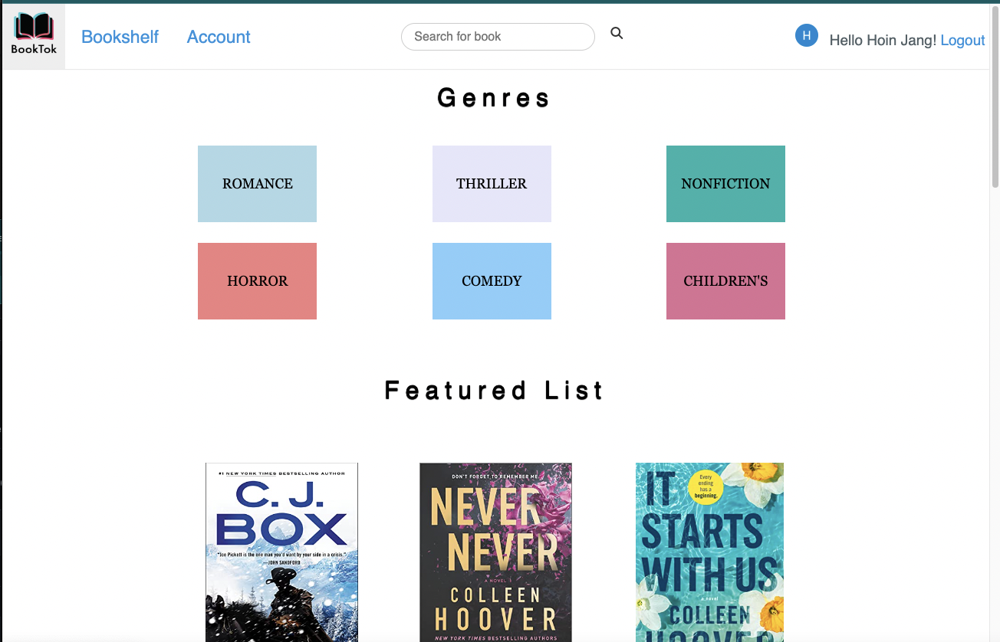
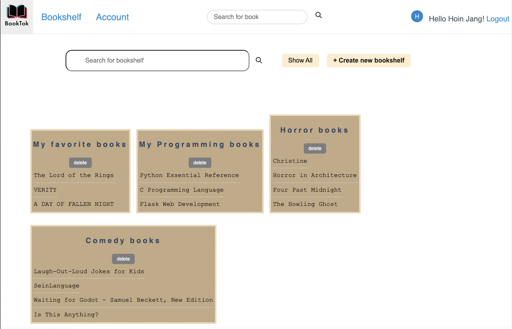
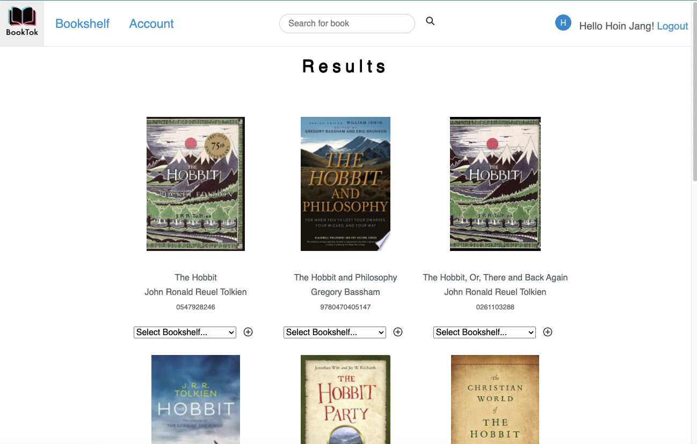
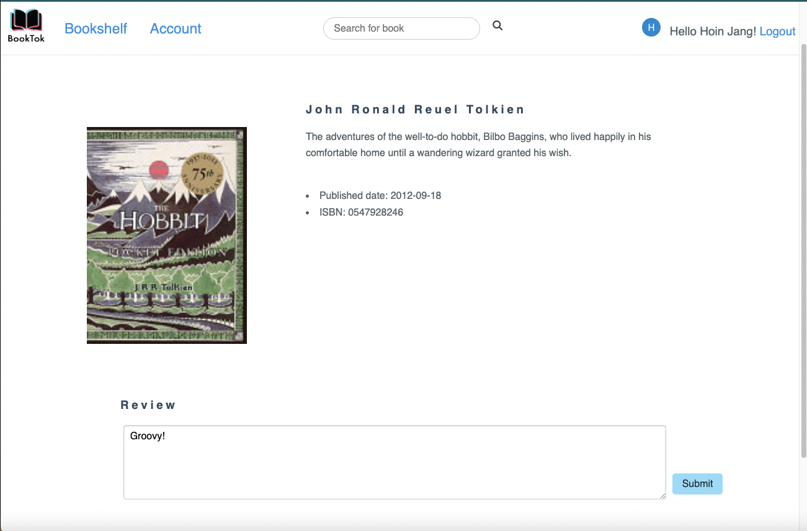

# Module 1 Group Assignment

CSCI 5117, Spring 2023, [assignment description](https://canvas.umn.edu/courses/355584/pages/project-1)

## App Info:

* Team Name: Booktok
* App Name: Booktok
* App Link: <https://booktok.onrender.com/> 

### Students

* Fiorela Esquivel Martinez esqui049@umn.edu
* Hoin Jang, jang0064@umn.edu
* Monika Bartulovic, bartu043@umn.edu
* Sol Kim kim01540@umn.edu
* ...

## Key Features

* Booktok uses the Google Books APIs to search for genres and individual book titles
* Booktok uses the New York times APIs to show NYT Bestseller (Featured List)

## Screenshots of Site
Figure 1: This is BookTok homepage ,which features a search bar, some genres and the bestsellers of books. 

Figure 2: This is a user's bookshelf page that has a form to create/delete a new bookshelves and shows their current bookshelves.

Figure 3: This is search results page for book "hobbit"

Figure 4: This is the detailed book page that appears when the user clicks on one of the images of "The hobbit" books.

## Mock-up 
Mock-ups link : <https://www.figma.com/file/0xv3ZRWf61KXjlvsNLr7UL/BookTok-WireFrame?node-id=0%3A1>
## External Dependencies

* Google Books API / NYT API: We used Google Books API and NYT API to search for genres,individual book titles and show bestsellers of books. This was primarily accomplished by using their search API interpolation. After a user adds a search result, we query their main API interpolation for a work to get information on author, title, and cover image. 

  Such as: <https://www.googleapis.com/books/v1/volumes?q={book_title}&key={Google_API_KEY}> 
  In this case, book title is what user search and the key of Google_API_KEY is in .env file

* python-dotenv: This library was used to handle loading the .env file more easily

* FontAwesome: We used FontAwesome to add styling of letters

* Pure CSS : We used Pure css to design our table, book lists, making a responsive website
